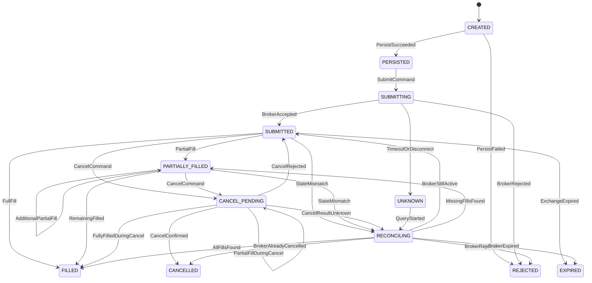

# 订单状态机

## 1. 范围

本文档定义订单意图和券商订单的状态机，覆盖：

- 部分成交。
- 撤单及其与成交的竞争。
- 废单和拒单。
- 重复信号和重复回调。
- 提交结果未知。
- 程序重启。
- 券商与本地状态不一致后的对账修正。

订单状态机只负责执行，不负责生成策略信号或决定组合目标。

## 2. 订单意图状态

```text
PENDING_RISK
  | approve          | reject
  v                  v
APPROVED           REJECTED
  | consume          | expire/cancel
  v                  v
CONSUMED           EXPIRED/CANCELLED
```

规则：

- 只有 `APPROVED` 意图可以创建订单。
- 一个意图同时只能有一个活动订单链。
- 撤单重报创建新 Order，但继续引用同一个意图。
- 意图过期后，迟到的券商应答不能创建新订单，只能进入恢复处理。

## 3. 订单状态

非终态：

- `CREATED`
- `PERSISTED`
- `SUBMITTING`
- `SUBMITTED`
- `PARTIALLY_FILLED`
- `CANCEL_PENDING`
- `UNKNOWN`
- `RECONCILING`

终态：

- `FILLED`
- `CANCELLED`
- `REJECTED`
- `EXPIRED`

### 状态含义

| 状态 | 含义 |
| --- | --- |
| CREATED | 内存中创建，尚未持久化，不允许调用券商 |
| PERSISTED | 本地事务已提交，可以进入提交步骤 |
| SUBMITTING | 正在调用券商，提交结果尚不确定 |
| SUBMITTED | 券商确认受理并返回订单号 |
| PARTIALLY_FILLED | 已有成交且仍有剩余数量 |
| CANCEL_PENDING | 已请求撤单，等待券商确认 |
| UNKNOWN | 提交或查询结果未知，禁止重发 |
| RECONCILING | 正在通过订单和成交查询恢复状态 |
| FILLED | 累计成交量等于请求数量 |
| CANCELLED | 券商确认撤单，剩余数量不再成交 |
| REJECTED | 券商拒单或废单，未形成有效委托 |
| EXPIRED | 订单超过有效期或交易所失效 |

## 4. 状态图



## 5. 合法迁移

| 当前状态 | 事件 | 条件 | 新状态 | 副作用 |
| --- | --- | --- | --- | --- |
| CREATED | PersistSucceeded | Order 和首事件已提交 | PERSISTED | 生成 client_order_id |
| CREATED | PersistFailed | 事务失败 | REJECTED | 告警，不调用券商 |
| PERSISTED | SubmitCommand | 意图仍有效且风控有效 | SUBMITTING | 先写迁移，再调用券商 |
| SUBMITTING | BrokerAccepted | 返回有效订单号 | SUBMITTED | 保存 broker_order_id |
| SUBMITTING | BrokerRejected | 明确拒单 | REJECTED | 保存拒单码 |
| SUBMITTING | Timeout/Disconnect | 无法确认结果 | UNKNOWN | 禁止重发 |
| SUBMITTED | PartialFill | 0 < filled < requested | PARTIALLY_FILLED | 保存 Fill 和持仓 |
| SUBMITTED | FullFill | filled = requested | FILLED | 保存 Fill 和终态 |
| SUBMITTED | CancelCommand | 订单仍可撤 | CANCEL_PENDING | 持久化撤单意图 |
| PARTIALLY_FILLED | AdditionalFill | 累计仍小于请求量 | PARTIALLY_FILLED | 追加 Fill |
| PARTIALLY_FILLED | RemainingFilled | 累计等于请求量 | FILLED | 追加 Fill，转终态 |
| CANCEL_PENDING | CancelConfirmed | 券商确认撤单 | CANCELLED | 释放剩余冻结 |
| CANCEL_PENDING | PartialFillDuringCancel | 撤单前已有部分成交，仍有剩余 | CANCEL_PENDING | 先记成交，继续等待撤单结果 |
| CANCEL_PENDING | FullyFilledDuringCancel | 撤单前全部成交 | FILLED | 记成交后忽略撤单确认 |
| CANCEL_PENDING | CancelRejected | 券商拒绝撤单 | SUBMITTED/PARTIALLY_FILLED | 保持活动 |
| UNKNOWN | QueryStarted | 已进入对账流程 | RECONCILING | 停止新开仓 |
| RECONCILING | BrokerStateFound | 状态可确认 | 对应状态 | 补写缺失事件 |

终态允许的唯一例外是发现迟到成交或对账差异。此时产生
`RECONCILING` 修正流程，不允许直接静默修改终态订单。

## 6. 部分成交处理

每次成交按以下顺序处理：

1. 校验 `broker_trade_id` 唯一性。
2. 写入 Fill。
3. 更新累计成交和剩余数量。
4. 更新加权成交价。
5. 更新资金和持仓 Lot。
6. 写入 OrderTransition。
7. 触发组合、风控和监控更新。

部分成交不会产生新订单。

如果剩余数量大于 0，订单保持活动，除非收到明确的撤单、废单或过期事件。

## 7. 撤单流程

撤单是新的业务命令，必须经过状态机：

1. 校验订单处于 `SUBMITTED` 或 `PARTIALLY_FILLED`。
2. 先在本地写入 `CANCEL_PENDING`。
3. 调用券商撤单接口。
4. 根据订单和成交查询结果决定最终状态。

撤单请求重复到达时返回已有撤单命令，不重复调用券商。

撤单成功只表示剩余数量不再成交。已经发生的 Fill 永远保留。

如果撤单确认后收到迟到成交：

- 立即冻结相关策略。
- 写入异常成交事件。
- 进入 `RECONCILING`。
- 以券商资金和持仓快照校正。

## 8. 券商接口最低要求

为支持上述状态机，BrokerPort 至少需要：

- 按 `client_order_id` 查询本地订单对应的券商委托。
- 按 `broker_order_id` 查询订单详情。
- 查询指定订单的全部成交。
- 查询账户当日全部订单和成交。
- 单笔撤单。
- 查询可撤订单。
- 查询资金和持仓快照。

当前 QMT 适配器已经具备提交限价单和全部撤单能力，但尚缺单笔撤单、订单查询、
成交查询和按 client_order_id 关联订单的能力，因此在接入状态机前必须补齐这些接口。

## 9. 废单和拒单

废单或拒单状态为 `REJECTED`。

原因包括：

- 资金不足。
- 持仓不足。
- 价格超出涨跌停。
- 非交易时段。
- 非整手。
- 账户未登录。
- 券商内部错误。
- 订单字段不合法。

处理要求：

- 保存券商错误码、原始消息和发生时间。
- 不产生 Fill 和持仓变化。
- 对应 OrderIntent 标记为 `CONSUMED`，不允许自动重发相同意图。
- 自动重试必须创建新意图，并再次经过风控。

## 10. 重复信号

重复信号由以下组合识别：

`strategy_instance_id + bar_end_time + symbol + action + strategy_state_version + data_version`

处理：

1. 查 Signal 幂等键。
2. 已存在时返回原 Signal。
3. 如果原 Signal 已转成 Intent 或 Order，不再创建新业务对象。
4. 仅记录 `DEDUPLICATED` 审计事件。

合法的新买入信号必须具备新的 `bar_end_time` 或新的 `strategy_state_version`。

## 11. 重复回调

重复回调包括：

- 相同订单状态重复推送。
- 相同成交重复推送。
- 连接恢复后查询到已处理订单和成交。

处理：

- OrderTransition 按 `broker_event_id` 或 `order_id + sequence_no` 去重。
- Fill 按 `account_id + broker_trade_id` 去重。
- 重复事件只记录接收次数，不再更新持仓和资金。
- 内容哈希冲突时进入 `RECONCILING`。

## 12. 程序重启

启动恢复顺序：

1. 获取账户单写者锁。
2. 禁止新订单提交。
3. 加载所有非终态 StrategyInstance、OrderIntent、Order 和未确认 Fill。
4. 连接券商。
5. 查询券商订单、成交、持仓和资金。
6. 按 client_order_id 和 broker_order_id 关联订单。
7. 补写缺失 OrderTransition 和 Fill。
8. 校验 Position 和 CashSnapshot。
9. 解决状态差异。
10. 对账完成后才允许恢复策略。

重启状态处理：

| 重启前状态 | 恢复动作 |
| --- | --- |
| CREATED/PERSISTED | 确认券商无订单后，等待明确恢复命令，不自动重发 |
| SUBMITTING/UNKNOWN | 先查询券商，禁止重发 |
| SUBMITTED | 查询最新订单和成交 |
| PARTIALLY_FILLED | 查询剩余数量和全部成交 |
| CANCEL_PENDING | 查询订单、成交和撤单结果 |
| RECONCILING | 继续对账 |
| 终态 | 校验是否有迟到成交 |

恢复期间系统状态为 `STOP_OPEN`。

## 13. 对账修正

状态差异按以下优先级处理：

`券商成交与账户记录 > 本地持久化状态 > 内存状态`

差异类型：

- 券商有订单，本地无订单。
- 本地有订单，券商无订单。
- 成交数量不一致。
- 持仓数量不一致。
- 可用资金不一致。
- 订单终态不一致。

无法解释的差异进入 `RECONCILING`，禁止开仓，并要求人工确认或明确的自动修复规则。

## 14. 状态迁移持久化

每次状态变化写入：

- `from_status`
- `to_status`
- `event_type`
- `source`
- `broker_event_id`
- `sequence_no`
- `broker_timestamp`
- `recorded_at`
- `payload_hash`

状态表只保存当前快照，OrderTransition 保存完整历史。

## 15. 状态机不变量

- 没有持久化订单，不能调用券商下单。
- 没有风险批准，不能创建订单。
- 提交结果未知时不能重发。
- `filled + remaining = requested`。
- 终态订单不能直接回到活动状态。
- 成交、持仓和资金必须属于同一个本地事务。
- 同一券商成交只能入账一次。
- `CANCEL_PENDING` 不能阻止已经发生的成交。
- 重启后必须先对账再开仓。

## 16. 验收场景

必须覆盖：

1. 正常全量成交。
2. 一次部分成交后全部成交。
3. 多次部分成交。
4. 部分成交后撤单成功。
5. 撤单请求与成交同时发生。
6. 券商拒单和废单。
7. 提交超时后查询确认已受理。
8. 提交超时后查询确认未受理。
9. 重复状态回调。
10. 重复成交回调。
11. 重复信号。
12. 在 `PERSISTED`、`SUBMITTING`、`SUBMITTED`、`PARTIALLY_FILLED`、
    `CANCEL_PENDING` 和 `RECONCILING` 状态重启。
13. 本地与券商持仓不一致。
14. 本地与券商资金不一致。
15. 撤单成功后收到迟到成交。
